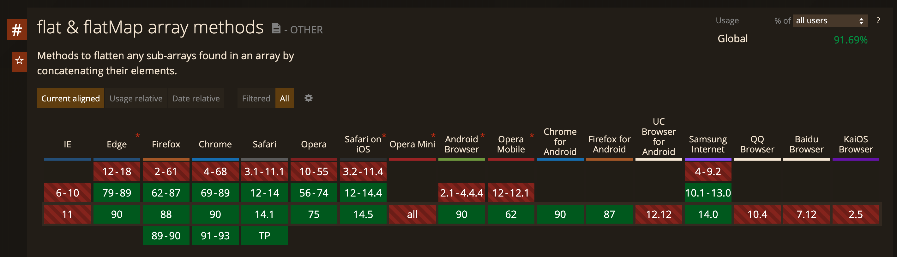

# Array.prototype.flat()

ES6 support Array.prototype.flat() methods but this methods only flattening first depth, and also does not support
on old browser or old Nodejs engine



<br><br>
## Implementing flat()

```javascript
const flat = (...arg) => arg.reduce((acc, cur) => {
  return acc.concat(...cur);
}, []);              

const array1 = [[1], 2, [3]];

// flat implement
console.log(flat(array1));
// [1,2,3]

// ES6
console.log(array1.flat());
// [1,2,3]
```

### Limitation of flat()

```javascript
const nestedArray = [[1, [2, 3]], 4, [5]];

console.log(flat(nestedArray));
// [1,[2,3],4,5]

// ES6
console.log(nestedArray.flat());
// [1,[2,3],4,5]
```

<br><br>

## Implementing flatAll()

```javascript
const flatAll = (...arg) => arg.reduce((acc, cur) => {
  cur = cur.map((e) => {
    if (Array.isArray(e)) {
      return flatAll(e);
    }
    
    return e;
  });
  
  return acc.concat(...cur);
}, []);


// flat implement
console.log(flatAll(nestedArray));
// [1, 2, 3, 4, 5]

// ES6
console.log(nestedArray.flat());
// [1, [2, 3], 4, 5]
```
